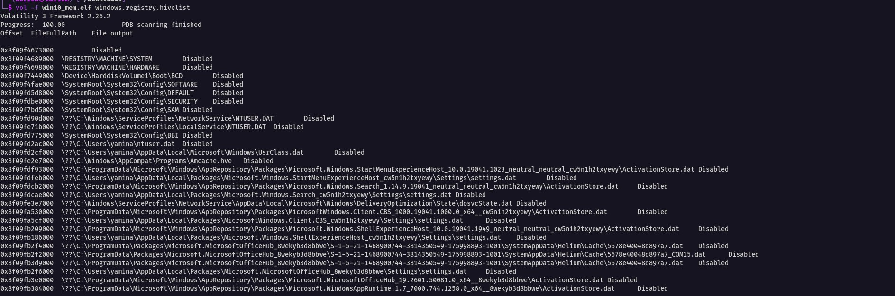
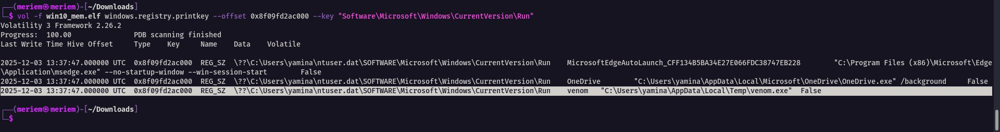
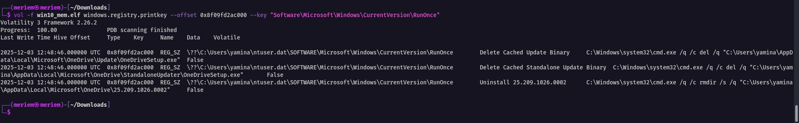
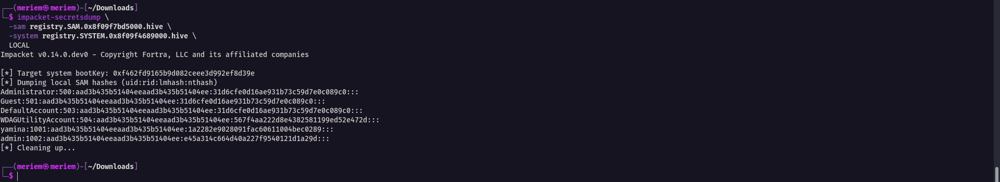
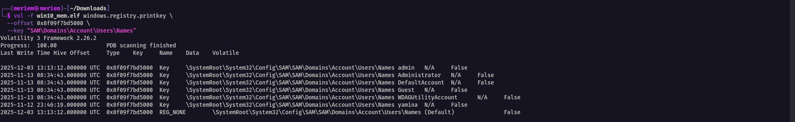
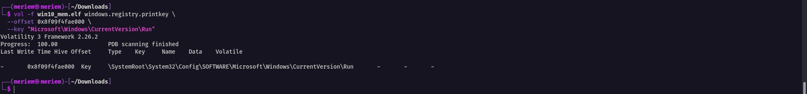
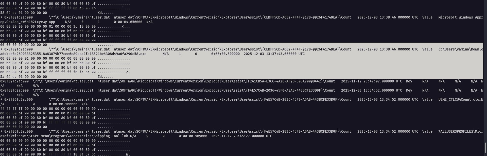

# Analyzing Windows Registry for Evidence of Malicious Activity

## Introduction

In Windows there is an interesting concept which is the Windows Registry, a critical hierarchical database that contains low-level settings for the OS and the apps installed. Most malwares and malicious processes often modify or create registry keys for persistence and detection evasion, so analyzing them can reveal traces and evidence of such bad activities and provide valuable information during the forensics and investigation workflow. For this project, we are interested in using Volatility to analyze and dig through Windows Registry hives extracted from a memory dump of an infected machine, in order to identify security incidents.

## Lab Setup

To complete this project we need a memory image of an infected Windows machine, as discussed above, for the analysis. It can be dumped from a physical or virtual machine (we are going to use an image of a virtual machine).

### Pre-requisites
- Basic understanding of Windows OS and the Windows Registry
- Familiarity with the command-line interface

### Tools used
- **Volatility 3**: advanced memory forensics framework
- **Impacket (secretsdump)**: used to decrypt and dump password hashes from registry hives

### Malware sample identified
`ed0a26904442535518a83879b77cee6e89eea4fa18521be4308d49a6fa290c58`

---

## Step 1: Extracting Windows Registry Hives from the Memory Image

We start by checking the available profile info:

```
vol -f win10_mem.elf windows.info
```

Then we list all the registry hives present in the memory image using the hivelist plugin:

```
vol -f win10_mem.elf windows.registry.hivelist
```



This gives us the offsets of all the hives loaded in memory (SOFTWARE, SYSTEM, SAM, NTUSER.DAT, etc.). We will use these offsets in the next steps.

### Findings in the user's NTUSER.DAT

Checking the Run key of the user's NTUSER.DAT hive:

```
vol -f win10_mem.elf windows.registry.printkey --offset 0x8f09fd2ac000 --key "Software\Microsoft\Windows\CurrentVersion\Run"
```



We can see a key written by a suspicious process called `venom.exe`, running from `C:\Users\yamina\AppData\Local\Temp\venom.exe`. This is clearly not a standard Windows process, and as we can see, it is being executed from the Temp folder, which indicates strong and typical malicious activity.

We also checked the RunOnce key:

```
vol -f win10_mem.elf windows.registry.printkey --offset 0x8f09fd2ac000 --key "Software\Microsoft\Windows\CurrentVersion\RunOnce"
```



Those entries were written by `cmd.exe` at the same time the malware was being executed. It set them to delete the cached OneDrive update binaries and remove the installation folder. This might be a cleanup, to cover the traces.

---

## Step 2: Analyzing the SAM Hive for User Information

**Objective:** use Volatility to analyze the SAM hive and extract user account information.

The SAM hive contains:
- User accounts
- Password hashes (encrypted)

The SYSTEM hive contains:
- The boot key (SysKey)

Windows uses the boot key from SYSTEM to encrypt/decrypt the data stored in SAM.

We use impacket-secretsdump:

```
impacket-secretsdump \
  -sam registry.SAM.0x8f09f7bd5000.hive \
  -system registry.SYSTEM.0x8f09f4689000.hive \
  LOCAL
```



secretsdump reads the SYSTEM hive, extracts the SysKey/BootKey, then uses it to decrypt the hashes stored in SAM and displays the local accounts with their NTLM hashes.

We can also enumerate the accounts directly from the SAM hive without secretsdump:

```
vol -f win10_mem.elf windows.registry.printkey \
  --offset 0x8f09f7bd5000 \
  --key "SAM\Domains\Account\Users\Names"
```



---

## Step 3: Investigating Autorun Entries in the Software Hive

**Objective:** identify potential autorun entries in the SOFTWARE hive that could indicate malicious activity.

```
vol -f win10_mem.elf windows.registry.printkey --offset 0x8f09f4fae000 --key "Software\Microsoft\Windows\CurrentVersion\Run"
```



**Interpretation:** the key exists, but it contains no autorun entries. So unlike the NTUSER.DAT Run key from Step 1, the malware did not set up persistence at the machine-wide (SOFTWARE) level, only at the user level.

---

## Step 4: Examining UserAssist Keys in the NTUSER.DAT Hive

**Objective:** analyze the UserAssist keys to determine which applications were recently executed by the user.

```
vol -f win10_mem.elf windows.registry.userassist
```



We found an entry confirming the execution of the malicious file.

### Timeline reconstructed from UserAssist

| Time (UTC) | Activity |
|---|---|
| 10:34:18 | WinRAR.exe executed |
| 12:46:54 | PowerShell opened |
| 12:55:23 | Windows Defender Firewall with Advanced Security opened |
| 13:22:10 | 7z1900-x64.exe executed |
| 13:24:08 | UserAccountControlSettings.exe executed |
| 13:30:43 | Command Prompt opened |
| 13:37:43 | ed0a26904442535518a83879b77cee6e89eea4fa18521be4308d49a6fa290c58.exe executed |
| 13:34 - 13:38 | Edge, Explorer, Control Panel activity |

UserAssist confirms the execution of the suspicious file `ed0a26904442535518a83879b77cee6e89eea4fa18521be4308d49a6fa290c58.exe` from the Downloads directory at **2025-12-03 13:37:43 UTC**. The activity before that (PowerShell, Command Prompt, 7-Zip, UAC settings) suggests the user was preparing the environment before running the malware, probably extracting it from an archive and changing UAC settings to let it run.

---

## Conclusion

By analyzing the registry hives extracted from the memory image, we were able to:

- Confirm the execution of the malware `ed0a26904442535518a83879b77cee6e89eea4fa18521be4308d49a6fa290c58.exe` from the Downloads folder
- Find the persistence mechanism set up by the malware (`venom.exe` in the Run key of NTUSER.DAT, running from Temp)
- Find cleanup/anti-forensic RunOnce entries created by `cmd.exe` right after the malware was executed
- Dump the local SAM hashes and enumerate the user accounts on the system
- Reconstruct a timeline of user activity leading up to the malware execution using UserAssist

This shows how registry analysis from a memory dump can reveal both the persistence mechanism used by malware and the timeline of events around an infection.
